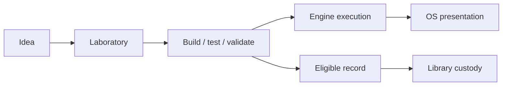

# DrMarchand’s Laboratory

> The research, software, experimentation, and technical-operations lane operated by Design Orchard LLC.

**Protected environment:** 🔬 DrMarchand’s Lab⚛︎ratory™ · **Public repository:** architecture and release-safe documentation only

## Mission

The Laboratory turns ideas into tested technical work: research, software, automation, infrastructure, interfaces, and experiments. Useful internal capability is not automatically a public product.

## System boundaries

| Surface | Role |
| --- | --- |
| DrMarchand’s Laboratory | Working research and development lane |
| DrMarchand’s ⚙︎ Nɛuro-Forge Engine™ | Bounded execution and orchestration |
| DrMarchand’s OS™ | Presentation, navigation, routing, and lifecycle state |
| 📚 DrMarchand’s ⚛︎ Library™ | Preservation, curation, and recall |
| KEJ Studio | Sibling creative-production lane |

## Publication boundary

This public repository may describe architecture, approved interfaces, released work, and reproducible evidence. It should not expose credentials, private infrastructure, storage topology, personal device identity, unpublished production markers, or unnecessary implementation detail.

Documentation is not runtime proof. A successful command proves that command in the observed environment; it does not automatically establish production health elsewhere.

## Authority

**Legal and operating company:** Design Orchard LLC  
**Operating DBA:** DrMarchand’s Laboratory

Rights and publication status remain work-specific. Existing licenses and file-specific notices continue to control their own scope.
